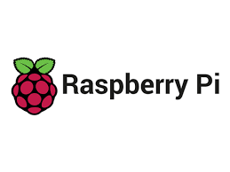
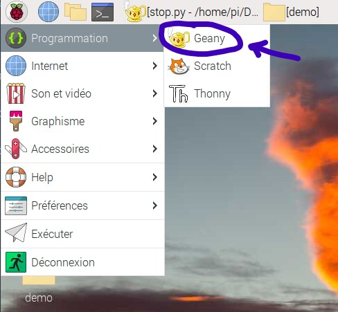
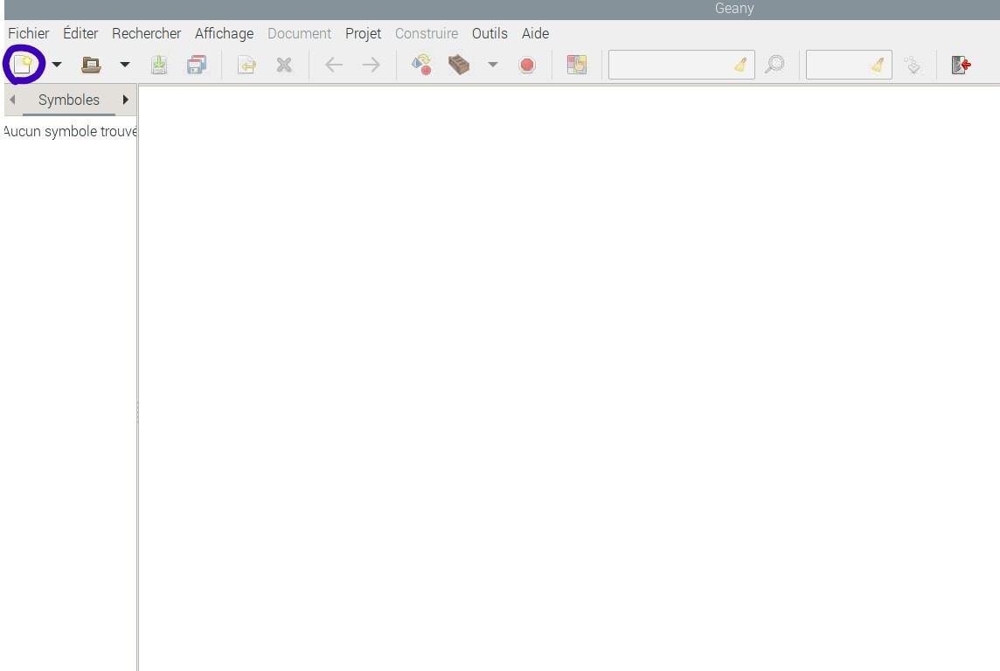
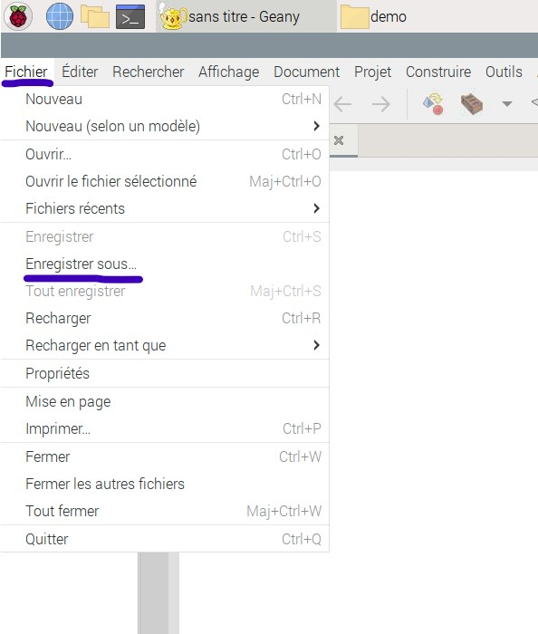
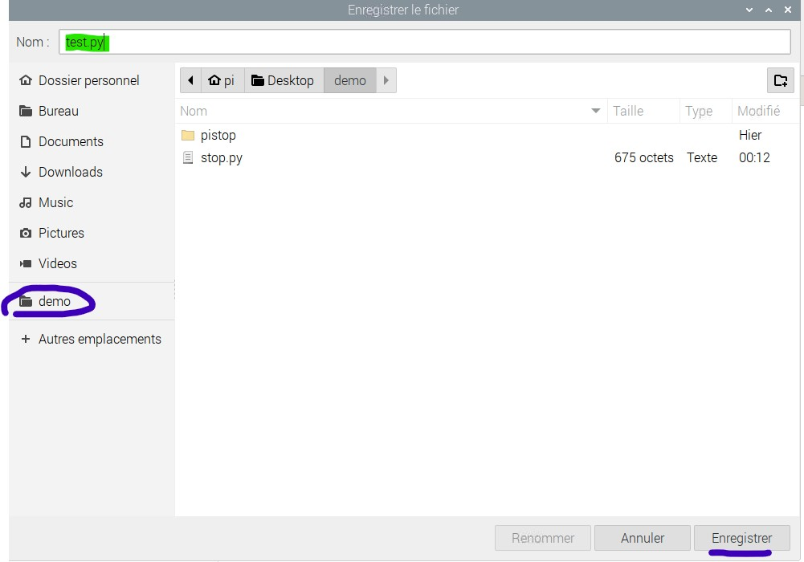
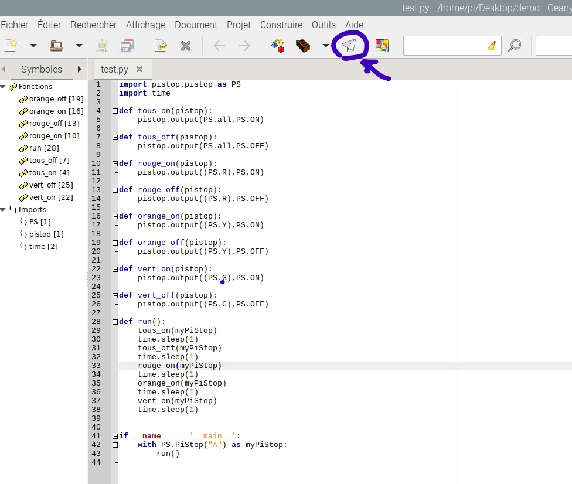
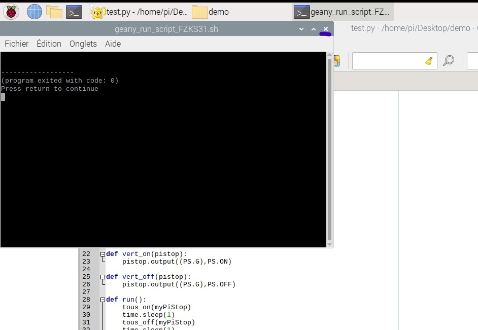

# Introduction

## Raspberry Pi

Le Raspberry Pi est un ordinateur miniature qui peut se brancher sur un écran, un clavier et une souris. Il a été créé par la Raspberry Pi Foundation, une organisation caritative qui vise à rendre l’informatique accessible et ludique pour tous1. Le Raspberry Pi peut fonctionner avec différents systèmes d’exploitation, comme Raspberry Pi OS, Twister ou Recalbox2.

Le Raspberry Pi peut servir à de nombreuses choses, comme apprendre à programmer, créer des projets électroniques, jouer à des jeux rétro, fabriquer un serveur web ou un centre multimédia. Il existe plusieurs modèles de Raspberry Pi, avec des caractéristiques et des prix différents. Le plus récent est le Raspberry Pi 4, qui offre plus de puissance et de connectivité que les précédents.

Le Raspberry Pi est donc un outil polyvalent et abordable qui permet de découvrir le monde de l’informatique et de réaliser ses propres idées. C’est aussi une communauté mondiale de passionnés qui partagent leurs créations et leurs conseils sur internet.

## Pi-Stop

Le Pi-stop est un accessoire électronique qui se branche sur le port GPIO du Raspberry Pi. Il se compose de trois LEDs de couleur rouge, jaune et verte, qui peuvent être contrôlées par des scripts Python. Le Pi-stop permet de simuler un feu de circulation ou de créer d’autres projets ludiques et éducatifs.

Pour utiliser le Pi-stop, il faut le connecter aux broches appropriées du port GPIO, en respectant les couleurs des LEDs. Ensuite, il faut écrire un programme Python qui utilise la bibliothèque GPIO Zero pour allumer et éteindre les LEDs selon une séquence définie.

Le Pi-stop est donc un moyen simple et amusant de découvrir la programmation et l’électronique avec le Raspberry Pi. Il existe plusieurs tutoriels et ressources en ligne pour apprendre à utiliser le Pi-stop.

## Geany

Geany est un éditeur de texte qui permet de créer et de modifier des fichiers de code source dans différents langages de programmation. Il offre des fonctionnalités utiles pour les développeurs, comme la coloration syntaxique, l’autocomplétion, la recherche et le remplacement ou encore la gestion de projets.

Geany est aussi un environnement de développement intégré (IDE), c’est-à-dire qu’il intègre des outils pour compiler, exécuter et déboguer les programmes.

Geany est un logiciel libre et polyvalent qui permet de réaliser des projets informatiques de manière simple et efficace. Il est adapté aux débutants comme aux experts, et il peut être personnalisé avec des thèmes et des plugins.

### Lancez Geany

Pour lancer Geany, cliquez sur l’icône dans le menu principal

### Créez un nouveau fichier

Afin de créer un nouveau fichier, cliquez sur le bouton Nouveau dans la barre d’outils

### Enregistrez votre fichier

Vous devez enregistrer votre fichier avant de pouvoir l’exécuter. Pour cela, cliquez sur Fichier > Enregistrer sous dans le menu principal de Geany.

Ensuite, choisissez un nom de fichier et enregistrez-le dans le dossier de "demo" que vous trouverez dans les raccourcis de la barre latérale gauche.

Vous pourrez ensuite enregistrer votre fichier en cliquant sur le bouton Enregistrer (💾) dans la barre d’outils ou en utilisant le raccourci clavier Ctrl + S.

### Lancez votre programme

Pour lancer votre programme, cliquez sur le bouton Exécuter (l'avion en papier) dans la barre d’outils.

### Arrêtez votre programme

Pour arrêter votre programme, cliquez sur le bouton Arrêter (Le panneau stop 🛑) dans la barre d’outils. Vous pouvez aussi fermer la fenêtre du terminal.

