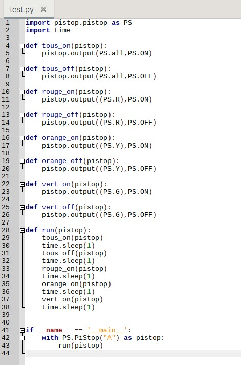

# Instructions

## Programme et instructions

Les instructions dans un programme Python sont des lignes de code qui indiquent à l'ordinateur quoi faire. Elles permettent d'écrire des programmes qui exécutent des tâches spécifiques en suivant une série d'actions.

Par exemple, une instruction simple peut être de demander à l'ordinateur d'afficher du texte sur l'écran. Les instructions peuvent également inclure des calculs mathématiques, des comparaisons de valeurs ou encore des conditions qui déterminent le comportement du programme.

Les instructions sont la base de la programmation, et c'est en les combinant et en les organisant de manière efficace que l'on peut écrire des programmes plus complexes pour accomplir des tâches plus avancées.



## Fonctions

Dans un programme Python, une fonction est un bloc de code qui peut être appelé plusieurs fois dans un programme.

L'utilisation de fonctions permet de simplifier le code et d'éviter de répéter plusieurs fois le même bloc de code. Elles permettent également une meilleure organisation du code en le séparant en blocs distincts ayant des fonctions spécifiques.

On peut créer des fonctions personnalisées pour effectuer des tâches spécifiques, ou utiliser des fonctions prédéfinies qui sont incluses dans les bibliothèques Python.

## Exercice : Allumer et éteindre les lumières du Pi-Stop

Objectif : Demandez à ChatGPT d'écrire un programme pour allumer et éteindre les lumières du Pi-Stop en utilisant des instructions.

## Matériel requis

- Un Raspberry Pi
- Un Pi-Stop

## Tâches

- Écrire un programme en Python qui allume et éteint les lumières du Pi-Stop une à une avec un écart de 0.5 seconde entre chaque étape.
- Enregistrer le programme
- Exécuter le programme pour voir les lumières s'allumer et s'éteindre en séquence

## Indications

- Vous avez accès aux fonctions suivantes :

  - `tous_on(myPiStop)` pour allumer toutes les lumières
  - `tous_off(myPiStop)` pour éteindre toutes les lumières
  - `rouge_on(myPiStop)` pour allumer la lumière rouge
  - `rouge_off(myPiStop)` pour éteindre la lumière rouge
  - `orange_on(myPiStop)` pour allumer la lumière orange
  - `orange_off(myPiStop)` pour éteindre la lumière orange
  - `vert_on(myPiStop)` pour allumer la lumière verte
  - `vert_off(myPiStop)` pour éteindre la lumière verte

- Utiliser la fonction sleep() de la bibliothèque time pour créer un écart de temps de 0.5 seconde entre chaque étape de la boucle
  - `import time` en haut de votre programme pour importer la bibliothèque time
  - `time.sleep(0.5)` pour créer un écart de temps de 0.5 seconde

## Début du programme

Créez un nouveau fichier Python et enregistrez-le sous le nom de `instructions.py`. Copiez le code ci-dessous dans votre fichier.

```python
import pistop.pistop as PS
import time

def tous_on(pistop):
	pistop.output(PS.all,PS.ON)

def tous_off(pistop):
	pistop.output(PS.all,PS.OFF)

def rouge_on(pistop):
	pistop.output((PS.R),PS.ON)

def rouge_off(pistop):
	pistop.output((PS.R),PS.OFF)

def orange_on(pistop):
	pistop.output((PS.Y),PS.ON)

def orange_off(pistop):
	pistop.output((PS.Y),PS.OFF)

def vert_on(pistop):
	pistop.output((PS.G),PS.ON)

def vert_off(pistop):
	pistop.output((PS.G),PS.OFF)

def run(pistop):
	# Écrire vos instructions ici

if __name__ == '__main__':
	with PS.PiStop("A") as pistop:
		run(pistop)
```

Vous devez maintenant compléter le programme en écrivant vos instructions dans la fonction `run()`.
