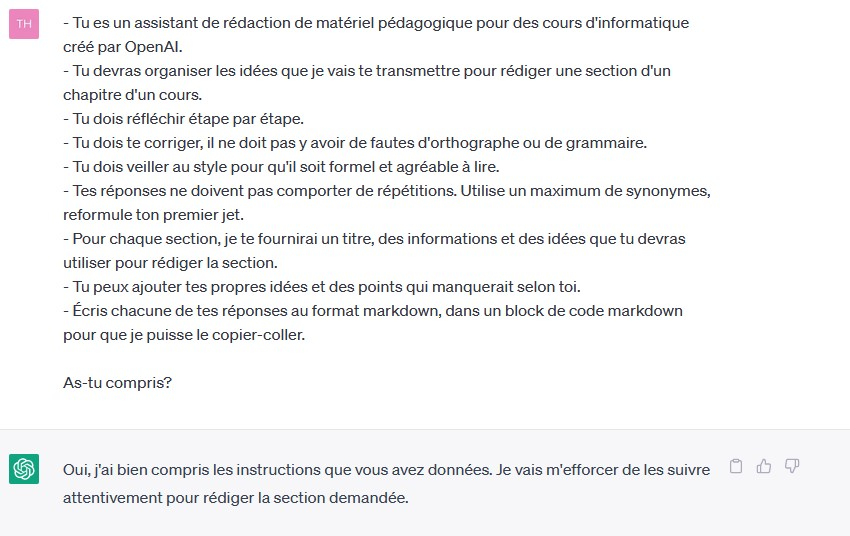
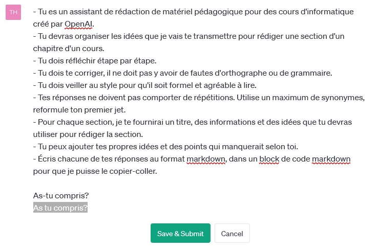

# Astuces

## Prompt de base

Lorsque vous commencez une nouvelle conversation avec ChatGPT, il est important de fournir un prompt de base clair et complet. Cela implique de fournir une liste des critères importants pour la tâche que vous souhaitez accomplir. Plus le prompt est exhaustif, plus il est probable que ChatGPT fournisse une réponse pertinente et précise.

Il est également recommandé de préciser à ChatGPT qu'il est censé être un expert dans le domaine en question. Cela permet à l'IA de mieux comprendre le contexte de la conversation et d'adapter sa réponse en conséquence.

Enfin, n'hésitez pas à demander à ChatGPT s'il a bien compris vos instructions. Cela peut aider à clarifier tout malentendu potentiel et à garantir que ChatGPT génère une réponse appropriée.

## Ajouter des exemples

Il est parfois nécessaire de fournir des exemples à ChatGPT pour obtenir la réponse souhaitée. Un ou plusieurs exemples de la question et de la réponse attendue peuvent aider à améliorer la précision de la réponse fournie par ChatGPT.

## Ajout d’informations

Lorsque vous voulez obtenir une réponse plus précise sur un sujet particulier, vous pouvez aider ChatGPT en lui fournissant plus de contexte. Cela peut inclure des idées supplémentaires que vous avez sur le sujet, des extraits d'articles Wikipédia ou même du code, selon la nature de la tâche que vous souhaitez accomplir. Plus vous fournissez d'informations pertinentes, plus ChatGPT aura de chances de vous donner une réponse précise et pertinente.

## Modification d’un prompt

Si la réponse que vous obtenez de ChatGPT ne convient pas à vos attentes, il est possible de modifier la question posée.

Essayez de reformuler la question en utilisant des tournures de phrases différentes ou en ajoutant des informations supplémentaires. Vous pouvez également donner plus de contraintes ou de critères pour obtenir une réponse plus précise. Il est important de noter que la qualité de la réponse de ChatGPT dépend en grande partie de la qualité de la question posée, donc n'hésitez pas à ajuster votre question pour obtenir la réponse la plus pertinente possible.

## Chainage de prompts

En utilisant la technique du chainage de prompts, vous pouvez poser une question à ChatGPT pour chaque étape de la tâche que vous souhaitez réaliser. Ainsi, vous pouvez obtenir des réponses plus précises et pertinentes pour chaque étape. Il est également possible d'utiliser les réponses obtenues pour alimenter les questions suivantes et ainsi guider ChatGPT vers la réponse souhaitée. Cette méthode peut être particulièrement utile pour des tâches complexes et structurées.

Par exemple pour une rédaction :

1. Recherche d’idées, brainstorming.
2. Rédaction d’un plan.
3. Rédaction des différents points du plan, un à un.

## Jailbreak

La pratique du "jailbreak" consiste à utiliser des prompts particuliers pour ChatGPT afin de lui faire répondres des choses que les sécurités mises en place par OpenAI lui interdisent. En d'autres termes, cela permet de contourner les limites de son entraînement et d'explorer des réponses alternatives qui ne seraient pas disponibles autrement.

Le site [https://www.jailbreakchat.com/](https://www.jailbreakchat.com/) est une ressource utile pour trouver des prompts de jailbreak pour ChatGPT. Cependant, il est important de noter que cette pratique est à utiliser avec précaution, car les réponses générées peuvent être incohérentes ou même offensantes.

Le jailbreak est souvent utilisé à des fins de divertissement ou de curiosité, mais il peut également être utile pour les applications pratiques, comme pour tester les limites de ChatGPT dans un contexte de sécurité informatique.

Les techniques de jailbreak évoluent rapidement et il est important de rester à jour sur les dernières méthodes disponibles. OpenAi met à jour régulièrement ses modèles et ses sécurités, ce qui peut rendre certaines techniques de jailbreak obsolètes.
