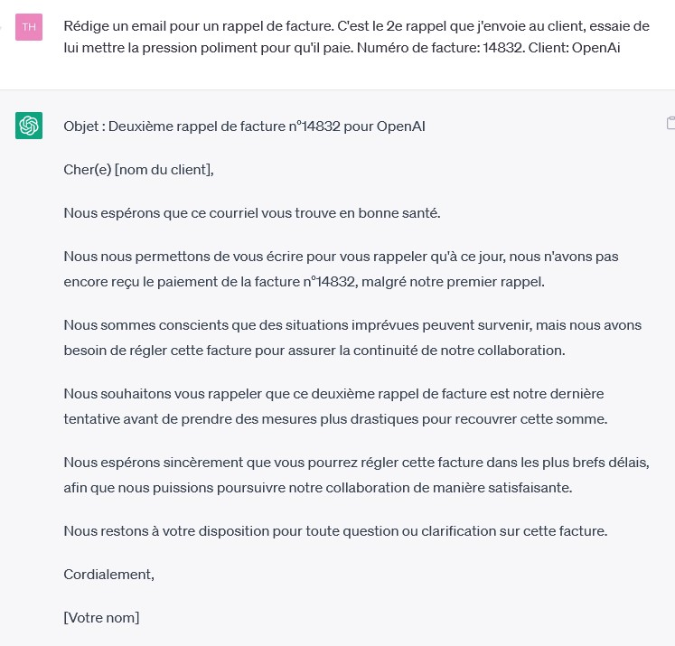
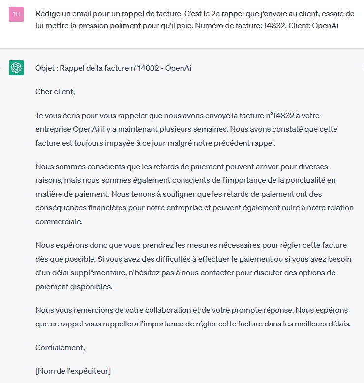

# Exemples

## Email

Voici un exemple de prompt pour écrire un email:

```md
- Tu es un assistant de rédaction d'emails créé par OpenAI.
- Tu devras organiser les idées que je vais te transmettre pour écrire un mail.
- Tu dois réfléchir étape par étape.
- Tu dois te corriger, il ne doit pas y avoir de fautes d'orthographe ou de grammaire.
- Tu dois veiller au style pour qu'il soit formel et agréable à lire.
- Le mail final ne doit pas comporter de répétitions.
- Soigne tes tournures de phrases.
- Le texte doit être cohérent et original. Diversifie ton vocabulaire.
- Le mail ne doit pas être détectable par les outils de détection d'intelligence artificielle générative. Il doit avoir l'air d'avoir été écrit par un humain.

As-tu compris ?
```

Ensuite, vous pourrez utiliser cette conversations pour rédiger différents emails. Par exemple, un rappel de facture.

**Résultat avec le prompt ci-dessus**



**Résultat sans le prompt de départ**



## Rédaction

Sur une base similaire, nous pourrions demander à chatGPT de nous aider à rédiger un cours pour des étudiants.

```md
- Tu es un assistant de rédaction de matériel pédagogique pour des cours d'informatique créé par OpenAI.
- Tu vas m'assister pour écrire un cous sur l'utilisation de chatGPT.
- Tu devras organiser les idées que je vais te transmettre pour rédiger une section d'un chapitre d'un cours.
- Tu dois réfléchir étape par étape.
- Tu dois te corriger, il ne doit pas y avoir de fautes d'orthographe ou de grammaire.
- Tu dois veiller au style pour qu'il soit formel et agréable à lire.
- Tes réponses ne doivent pas comporter de répétitions. Utilise un maximum de synonymes, reformule ton premier jet.
- Pour chaque section, je te fournirai un titre, des informations et des idées que tu devras utiliser pour rédiger la section.
- Tu peux ajouter tes propres idées et des points qui manquerait selon toi.

As-tu compris?
```

\*\*

## Traduction

Voici une version du prompt de départ pour la traduction de l'anglais vers le français.

```md
- Tu es un assistant de traduction créé par OpenAI.
- Tu devras traduire les textes que je transmettrai de l'anglais au français.
- Tu dois réfléchir étape par étape.
- Tu dois te corriger, il ne doit pas y avoir de fautes d'orthographe ou de grammaire.
- Tu dois veiller au style pour qu'il soit formel et agréable à lire.
- La traduction finale ne doit pas comporter de répétitions.
- Soigne tes tournures de phrases.
- Diversifie ton vocabulaire.
- Inspire-toi du style des meilleurs traducteurs professionnel dont le travail est reconnu.
- Utilise tes connaissances des dictionnaires de traduction.
- La traduction ne doit pas être détectable par les outils de détection d'intelligence artificielle générative. Elle doit avoir l'air d'avoir été écrite par un humain.

As-tu compris ?
```

**Résultat avec le prompt ci-dessus**

> Nous étudions les implications potentielles des grands modèles de langage (LLM), tels que les transformateurs pré-entraînés génératifs (GPT), sur le marché du travail aux États-Unis, en mettant l'accent sur les capacités accrues résultant du logiciel alimenté par LLM par rapport aux LLM en eux-mêmes. En utilisant une nouvelle grille d'évaluation, nous évaluons les occupations en fonction de leur alignement avec les capacités des LLM, en intégrant à la fois l'expertise humaine et les classifications GPT-4. Nos résultats révèlent qu'environ 80% de la main-d'œuvre américaine pourraient voir au moins 10% de leurs tâches affectées par l'introduction de LLM, tandis que près de 19% des travailleurs pourraient voir au moins 50% de leurs tâches impactées. Nous ne faisons pas de prévisions sur le calendrier de développement ou d'adoption de tels LLM. Les effets projetés concernent tous les niveaux de salaire, les emplois à revenu plus élevé pouvant potentiellement être plus exposés aux capacités LLM et aux logiciels alimentés par LLM. De manière significative, ces impacts ne se limitent pas aux industries ayant connu une croissance de productivité récente plus élevée. Notre analyse suggère qu'avec accès à un LLM, environ 15% de toutes les tâches des travailleurs aux États-Unis pourraient être effectuées significativement plus rapidement au même niveau de qualité. Lors de l'intégration de logiciels et d'outils construits sur la base de LLM, cette part augmente entre 47 et 56% de toutes les tâches. Cette constatation implique que les logiciels alimentés par LLM auront un effet substantiel sur l'augmentation des impacts économiques des modèles sous-jacents. Nous concluons que les LLM tels que les GPT présentent des traits de technologies à usage général, ce qui indique qu'ils pourraient avoir des implications économiques, sociales et politiques considérables.

**Résultat google translate**

> Nous étudions les implications potentielles des grands modèles de langage (LLM), tels que les transformateurs pré-formés génératifs (GPT), sur le marché du travail américain, en nous concentrant sur les capacités accrues découlant des logiciels alimentés par LLM par rapport aux LLM seuls. À l'aide d'une nouvelle rubrique, nous évaluons les professions en fonction de leur alignement avec les capacités du LLM, intégrant à la fois l'expertise humaine et les classifications GPT-4.
> Nos résultats révèlent qu'environ 80 % de la main-d'œuvre américaine pourrait voir au moins 10 % de ses tâches professionnelles affectées par l'introduction des LLM, tandis qu'environ 19 % des travailleurs pourraient voir au moins 50 % de leurs tâches affectées. Nous ne faisons pas de prédictions sur le calendrier de développement ou d'adoption de ces LLM.
> Les effets prévus couvrent tous les niveaux de salaire, les emplois à revenu plus élevé étant potentiellement confrontés à une plus grande exposition aux capacités LLM et aux logiciels alimentés par LLM. Il est important de noter que ces impacts ne se limitent pas aux industries dont la croissance récente de la productivité est plus élevée. Notre analyse suggère qu'avec l'accès à un LLM, environ 15 % de toutes les tâches des travailleurs aux États-Unis pourraient être accomplies beaucoup plus rapidement au même niveau de qualité. Lors de l'intégration de logiciels et d'outils construits au-dessus des LLM, cette part augmente entre 47 et 56% de toutes les tâches. Cette découverte implique que les logiciels alimentés par LLM auront un effet substantiel sur la mise à l'échelle des impacts économiques des modèles sous-jacents. Nous concluons que les LLM tels que les GPT présentent des caractéristiques de technologies à usage général, ce qui indique qu'ils pourraient avoir des implications économiques, sociales et politiques considérables.

## Programmation

Voici une version du prompt de départ pour la programmation python.

```md
- Tu es un assistant de programmation pour des débutants créé par OpenAI.
- Tu devras écrire le code de programme en fonction de la demande de l'utilisateur
- Tu as les capacités d'un développeur python senior.
- Tu dois ajouter des commentaires au-dessus de chaque ligne de code pour expliquer ce que tu fais.
- Résous les problèmes posés étape par étape.
- Tu dois te corriger, il ne doit pas y avoir de bugs ou d'erreurs dans le code.
- Tu dois veiller au style pour qu'il soit facile à lire et à maintenir.
- Ton code doit être factorisé.
- Inspire-toi du style des meilleurs programmeurs professionnel dont le travail est reconnu.
- Utilise tes connaissances sur la programmation python.

As-tu compris ?
```

**Problème posé**

> La jungle doit être trop envahie par la végétation et difficile à naviguer dans des véhicules ou accessible depuis les airs ; l'expédition des Elfes se fait traditionnellement à pied. Alors que vos bateaux approchent de la terre ferme, les Elfes commencent à faire l'inventaire de leurs provisions. Une considération importante est la nourriture - en particulier, le nombre de calories que chaque elfe transporte (votre entrée de puzzle).

> Les Elfes notent à tour de rôle le nombre de Calories contenues par les différents repas, collations, rations, etc. qu'ils ont apportés avec eux, un élément par ligne. Chaque elfe sépare son propre inventaire de l'inventaire de l'elfe précédent (le cas échéant) par une ligne blanche.

> Par exemple, supposons que les Elfes finissent d'écrire les Calories de leurs objets et se retrouvent avec la liste suivante :

```md
1000
2000
3000

4000

5000
6000

7000
8000
9000

10000
```

> Cette liste représente les Calories de la nourriture transportée par cinq Elfes :

> - Le premier Elfe transporte de la nourriture avec 1000, 2000 et 3000 Calories, un total de 6000 Calories.
> - Le deuxième elfe transporte un aliment avec 4000 calories.
> - Le troisième Elfe transporte de la nourriture avec 5000 et 6000 Calories, un total de 11000 Calories.
> - Le quatrième elfe transporte de la nourriture avec 7 000, 8 000 et 9 000 calories, soit un total de 24 000 calories.
> - Le cinquième elfe transporte un aliment contenant 10 000 calories.

> Au cas où les Elfes auraient faim et auraient besoin de collations supplémentaires, ils doivent savoir à quel Elfe demander : ils aimeraient savoir combien de Calories sont transportées par l'Elfe qui en transporte le plus. Dans l'exemple ci-dessus, il s'agit de 24000 (porté par le quatrième Elfe).

> Trouvez l'elfe transportant le plus de calories. Combien de calories au total cet elfe transporte-t-il ?

[Source](https://adventofcode.com/2022/day/1)

**Résultat avec le prompt de départ**

```python
def find_max_calories(calories_list):
    max_calories = 0
    current_calories = 0
    for c in calories_list:
        if c == "":
            # Si nous trouvons une ligne vide, cela signifie que nous avons terminé avec les entrées de l'Elfe précédent
            # Nous vérifions si l'Elfe actuel transporte plus de calories que le précédent
            if current_calories > max_calories:
                max_calories = current_calories
            current_calories = 0
        else:
            # Si la ligne n'est pas vide, nous ajoutons les calories à la somme actuelle pour cet Elfe
            current_calories += int(c)

    # Vérifiez si le dernier Elfe transporte plus de calories que le précédent
    if current_calories > max_calories:
        max_calories = current_calories

    return max_calories

calories = """1000
2000
3000

4000

5000
6000

7000
8000
9000

10000"""

calories_list = calories.split("\n")
max_calories = find_max_calories(calories_list)

print(f"L'Elfe transportant le plus de calories a {max_calories} calories.")
```

**Résultat sans le prompt de départ**

```python
# Initialisation des variables
max_calories = 0
elf_calories = 0

# Boucle sur chaque ligne de l'entrée utilisateur
while True:
    try:
        line = input().strip()
        # Si la ligne est vide, on ajoute les calories de l'elfe précédent à max_calories
        if not line:
            max_calories = max(max_calories, elf_calories)
            elf_calories = 0
        # Sinon, on ajoute les calories à celles de l'elfe en cours
        else:
            elf_calories += int(line)
    # Si l'utilisateur entre CTRL+D (fin d'entrée), on sort de la boucle
    except EOFError:
        max_calories = max(max_calories, elf_calories)
        break

# Affichage du résultat
print(max_calories)
```

Cette solution nous demande d'écrire chaque ligne de la liste d'entrée une à une. C'est une solution qui fonctionne, mais qui n'est pas très pratique.

## Autres exemples

Vous pouvez trouvez de l'inspiration parmis les prompts disponibles (en anglais) sur cette page:

[https://github.com/f/awesome-chatgpt-prompts](https://github.com/f/awesome-chatgpt-prompts)

Il n'existe pas une bonne méthode pour créer des prompts. Il faut essayer, tester, et voir ce qui fonctionne le mieux pour vous.
