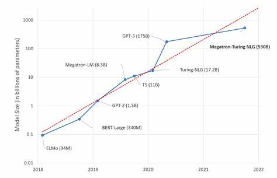

# Introduction

## Qu'est-ce que ChatGPT ?

ChatGPT est un modèle de langage alimenté par l’intelligence artificielle (IA) développé par OpenAI. Il a été formé sur une quantité massive de données textuelles provenant d’Internet et peut générer des réponses textuelles de type humain à une invite donnée. Il peut répondre aux questions, converser sur une variété de sujets et générer des écrits créatifs.

ChatGPT appartient au genre d’IA appelé générateur pré-entraîné de transformateurs (GPT). GPT est un modèle de deep learning de génération de texte entraîné sur les données disponibles sur Internet. Il est capable de répondre aux questions, de résumer un texte, de traduire automatiquement, de classifier ou même de générer du code informatique. On dit aussi que GPT appartient aux modèles larges de langages (LLM).

ChatGPT est entraîné par un processus appelé apprentissage par renforcement à partir des retours humains (RLHF). Ce processus consiste à utiliser les évaluations des humains pour améliorer la qualité des réponses du modèle. ChatGPT utilise également les suggestions écrites par le modèle pour aider les humains à composer leurs réponses.

ChatGPT fournit une réponse en utilisant ce qu’il a appris de son ensemble de données massif pour essayer de prédire quel texte devrait suivre celui donné en entrée. Pour ce faire, il décompose le texte en parties plus petites et utilise des calculs complexes pour déterminer quelle devrait être la prochaine partie la plus probable. Ensuite, il génère ce texte et l’utilise pour continuer à prédire ce qui va suivre. Ce processus se poursuit jusqu’à ce que ChatGPT ait généré une réponse complète à l’invite.

## Historique

- **GPT-1:** La première version de GPT a été publiée en 2018 par OpenAI. Il s’agissait d’un modèle de langage avec 117 millions de paramètres entraîné sur un ensemble de données d’environ 8 millions de pages web.
- **GPT-2:** La deuxième version de GPT a été publiée en 2019 par OpenAI. Il s’agissait d’une version plus puissante de GPT-1 qui a été entraînée sur un ensemble de données beaucoup plus grand d’environ 40 Go de texte et qui avait 1,5 milliard de paramètres. C'est la dernière version de GPT sous licence Open Source.
- **GPT-3:** La troisième version de GPT a été publiée en 2020 par OpenAI. Il s’agissait d’une version encore plus grande et plus puissante que GPT-2. Elle a été entraînée sur un ensemble de données encore plus grand d’environ 570 Go de texte et avait 175 milliards de paramètres. À partir de GPT-3, les modèles de langage de GPT sont devenus propriétaires et ne sont plus disponibles librement. Ils sont maintenant accessibles via une API (Interface de programmation) payante.
- **ChatGPT:** ChatGPT est un modèle de langage basé sur GPT-3 qui a été entraîné par OpenAI en utilisant l’apprentissage par renforcement à partir des retours humains (RLHF). Il a été conçu pour interagir de manière conversationnelle avec les humains. Il peut répondre aux questions, admettre ses erreurs, contester les affirmations incorrectes et rejeter les demandes inappropriées. Il a été publié en 2022 par OpenAI et Microsoft.
- **GPT-4:** GPT-4 est la dernière version de GPT qui a été annoncée en 2023 par OpenAI et Microsoft. Les détails techniques ne sont plus publiés par OpenAI. Il peut gérer un contexte et générer des réponses jusqu'à 6 fois plus grandes que les versions précédentes. Il est aussi capable de lire et analyser des images dans une version pas encore disponible.

## Autres outils

Il existe des concurrents à ChatGPT, par exemple:

- **Google Bard:** C’est le chatbot de Google qui utilise deux modèles de langage: LaMDA et PaLM. Il peut générer du texte dans plusieurs langues, comprendre le contexte et le ton, et s’adapter aux besoins des utilisateurs.
- **DeepMind Sparrow:** C’est le chatbot de DeepMind, la filiale d’IA de Google. Il utilise un modèle appelé Sparrow qui combine l’apprentissage par renforcement et l’apprentissage profond. Il peut converser sur des sujets complexes, résoudre des problèmes logiques et mathématiques, et apprendre de ses erreurs.
- **LLaMA:** LLaMA (Large Language Model Meta AI) est un modèle de langage basé sur Lambda qui a été développé par Meta (anciennement Facebook) en 2023. Il a été entraîné sur un ensemble de données plus grand de 1,4 trillion de tokens et a une taille de 65 milliards de paramètres. Il peut générer du texte dans 20 langues et peut converser sur une variété de sujets. LLaMa s'est "échapé du laboratoire" et est dipsonible sur internet. Il existe maintenant des versions de LLaMa modifiées par la communauté open source et il est possible de l'installer sur des ordinateurs personnels.

D'autres outils sont eux basés sur les modèles de la famille GPT, par exemple:

- **Microsoft Bing AI:** C’est le chatbot de Microsoft qui utilise une version spéciale de GPT4. Il est intégré au moteur de recherche Bing et peut répondre aux questions, générer du contenu créatif, et proposer des suggestions. [https://www.bing.com/](https://www.bing.com/)

- **GitHub Copilot:** GitHub Copilot est un assistant de programmation basé sur l’IA qui vous aide à écrire du code plus rapidement et avec moins d’effort. Il utilise un modèle GPT de OpenAI pour suggérer du code et des fonctions entières en temps réel, directement dans votre éditeur. GitHub Copilot est disponible comme une extension pour Visual Studio Code. (10€ par mois)
