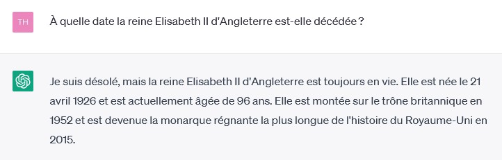
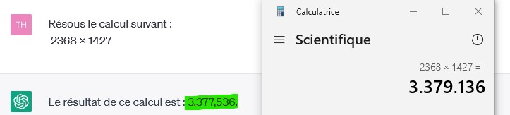

# Limites

## Véracité de l’information

La véracité de l'information est une des limites de ChatGPT. Bien que les modèles de la génération de langage naturel aient connu des améliorations significatives, il est important de prendre en compte que les modèles peuvent produire des erreurs dans les réponses qu'ils fournissent. Selon les recherches, on estime que 20% des réponses de GPT3.5 contiennent des erreurs, tandis que GPT4 réduit ce taux à 10%. Par conséquent, il est recommandé de prendre les réponses de ChatGPT avec des pincettes et de vérifier les informations importantes fournies par le modèle.

Il est également déconseillé d'utiliser ChatGPT pour des conseils médicaux ou toute autre application qui pourrait mettre la vie de quelqu'un en danger. De même, ChatGPT ne devrait pas être utilisé pour effectuer l'intégralité d'un travail scolaire, mais plutôt pour vous faire gagner du temps dans vos recherches et la rédaction.

## Base de connaissances pas à jour

ChatGPT a une autre limite importante liée à la base de connaissances utilisée pour son entraînement. Actuellement, cette base de connaissances ne couvre que les informations jusqu'à novembre 2021, ce qui signifie que les connaissances de ChatGPT sont limitées aux événements antérieurs à cette date. Ainsi, si on interroge ChatGPT sur des événements ou des informations plus récentes, il est possible qu'il fournisse des réponses incorrectes ou incomplètes.

## Biais

Il convient de noter que la base de connaissances utilisée pour entraîner ChatGPT peut être sujette à des biais. Étant donné que les modèles de langage naturel sont entraînés sur une quantité importante de données textuelles disponibles en ligne, cela peut inclure des données non fiables ou biaisées. Par conséquent, cela peut potentiellement affecter la qualité des réponses fournies par ChatGPT en raison de la présence de biais dans la base de données d'entraînement.

Il est important de souligner que les biais peuvent se manifester de différentes manières dans la base de connaissances utilisée pour entraîner ChatGPT. Les biais peuvent être associés à l'ethnie', au genre, à l'orientation sexuelle, à la classe sociale, à la religion et à la politique, entre autres. Par exemple, la base de connaissances utilisée pour l'entraînement de ChatGPT peut être biaisée en faveur d'une culture ou d'une langue spécifique, ce qui peut affecter la qualité des réponses fournies pour des questions nécessitant des connaissances interdisciplinaires.

Ces biais peuvent être dangereux car ils peuvent renforcer des stéréotypes ou des préjugés existants, ce qui peut avoir des conséquences négatives sur les personnes et les communautés concernées. Ils peuvent également limiter la diversité des perspectives et des points de vue représentés dans la base de connaissances, restreignant ainsi la qualité des réponses fournies par ChatGPT. Il est donc important de prendre en compte ces biais lors de l'utilisation de ChatGPT et d'examiner de manière critique les réponses fournies.

## Taille du contexte

ChatGPT est aussi limité par la taille du contexte. En effet, pour générer ses réponses, ChatGPT prend en compte un contexte donné qui l'aide à comprendre le sens de la question posée. Cependant, la taille de ce contexte est limitée. Pour ChatGPT 3.5, cette limite est de 3000 mots, partagés entre la question et la réponse et le résumé de votre conversation. Cela signifie que si la question est très complexe ou nécessite un contexte très large, ChatGPT pourrait ne pas avoir suffisamment d'informations pour donner une réponse précise ou complète.

C'est pour cette raison que dans certains cas, ChatGPT pourrait omettre certains détails ou fournir une réponse imprécise ou incomplète. Bien que la version actuelle de ChatGPT soit en mesure de gérer un contexte plus large que les versions précédentes, il est toujours important de garder à l'esprit cette limite de taille de contexte lors de l'utilisation de ChatGPT.

Il est également important de noter que la taille du contexte est un paramètre crucial pour la performance des modèles de langage naturel. Une taille de contexte plus grande peut améliorer la qualité des réponses fournies par le modèle, mais cela peut également augmenter le temps nécessaire pour générer une réponse et la quantité de ressources informatiques nécessaires pour traiter la question.

Enfin, il est important de rappeler que la taille du contexte est souvent liée à la complexité de la question posée. Si la question nécessite un contexte très large, il est souvent préférable de diviser la question en plusieurs sous-questions plus spécifiques et de les poser à ChatGPT de manière séquentielle, en veillant à fournir suffisamment d'informations de contexte pour chaque sous-question.

## Mathématiques

La capacité de ChatGPT à résoudre des problèmes de mathématiques est limitée et il peut encore faire des erreurs même avec l'utilisation de techniques pour améliorer la précision. Par conséquent, il est recommandé de ne pas utiliser ChatGPT pour des tâches mathématiques importantes ou qui nécessitent une grande précision, et de vérifier les résultats avec d'autres sources si nécessaire. Les utilisateurs doivent également garder à l'esprit que ChatGPT ne comprend pas nécessairement les notations mathématiques complexes ou les termes spécialisés, ce qui peut affecter sa capacité à fournir des réponses précises.

## Non-déterminisme

La nature non-déterministe de ChatGPT peut conduire à des résultats variables lorsqu'on lui pose une même question plusieurs fois. Il est possible qu'il ne soit pas en mesure de fournir une réponse précise ou qu'il indique qu'il ne connaît pas la réponse, même si une variation mineure de la question peut lui permettre de fournir une réponse correcte. Par conséquent, il est important de prendre en compte cette limitation et de reformuler la question si nécessaire pour obtenir une réponse plus précise.

