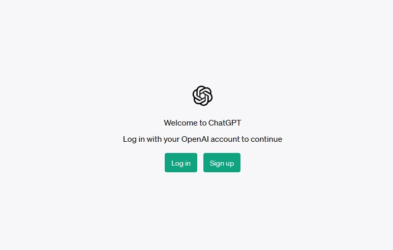
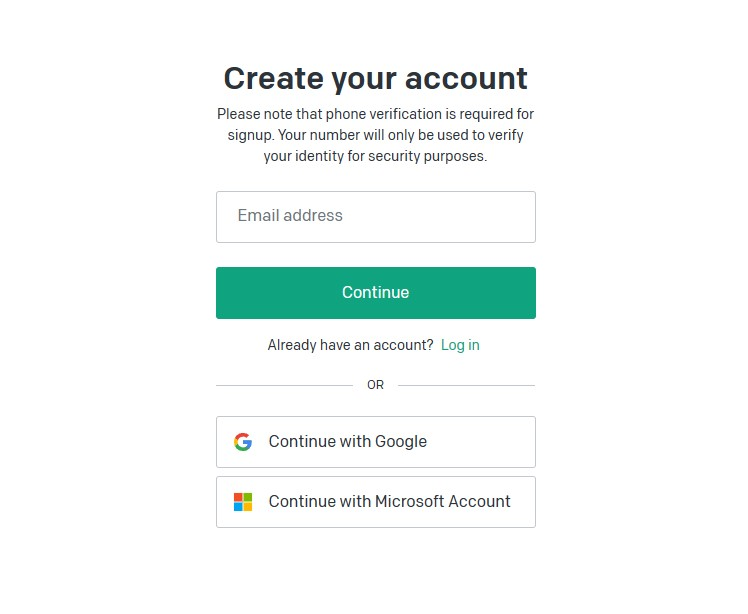
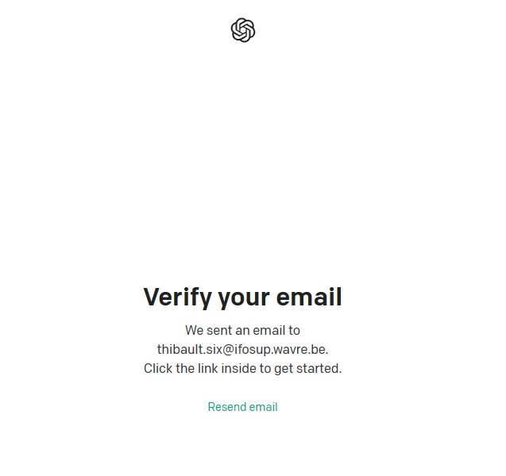
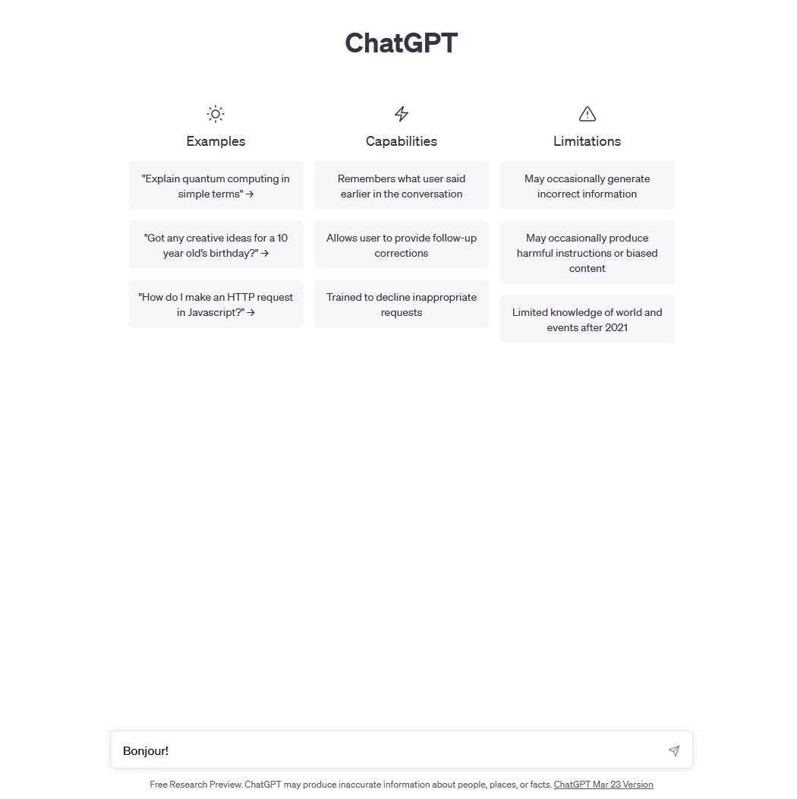

# Utilisation

## Création d'un compte

Pour utiliser chatGPT, vous devez d'abord vous inscrire sur le site web de chatGPT. Voici les étapes à suivre:

- Rendez-vous sur le site web de chatGPT: [https://chat.openai.com/](https://chat.openai.com/) ou [https://ai.com/](https://ai.com/)

- Cliquez sur le bouton "Sign up" ("s'inscrire") au centre de la page.

- Remplissez le formulaire d'inscription avec votre adresse e-mail puis votre mot de passe.

- Vous recevrez un e-mail de confirmation avec un lien pour activer votre compte. Cliquez sur le lien pour finaliser votre inscription.

- Vous devrez ensuite remplir un formulaire avec votre nom, votre prénom et votre date de naissance. Ensuite, vous devrez fournir un numéro de téléphone portable pour vérifier votre identité. Vous recevrez un code de vérification par SMS. Entrez ce code dans le formulaire pour terminer votre inscription.

## Connexion à votre compte

Félicitations, vous avez créé votre compte chatGPT! Vous pouvez maintenant commencer à utiliser le modèle de langage pour converser avec lui. Voici comment faire:

- Connectez-vous à votre compte chatGPT avec votre adresse e-mail et votre mot de passe en cliquant sur le bouton "Log in" ("Se connecter").

## Démarrez une conversation

- Pour commencer, écrivez un message dans la zone de texte en bas de la page et appuyez sur la touche Entrée ou cliquez sur le bouton "Envoyer".
  
- ChatGPT vous répondra dans la boîte de dialogue. Vous pouvez continuer la conversation en lui envoyant d'autres messages ou en choisissant parmi les suggestions qu'il vous propose.
- Vous pouvez créer de nouvelles conversations en cliquant sur le bouton "New chat" ("Nouvelle conversation") en haut à gauche de la page.
- Vous avez accès à vos conversations précédentes dans la liste de gauche. Vous pouvez les supprimer en cliquant sur le bouton "Supprimer" à côté de chaque conversation. Les titres des conversations sont générés automatiquement par chatGPT. Vous pouvez les modifier en cliquant sur le bouton "Modifier" à côté de chaque conversation.
